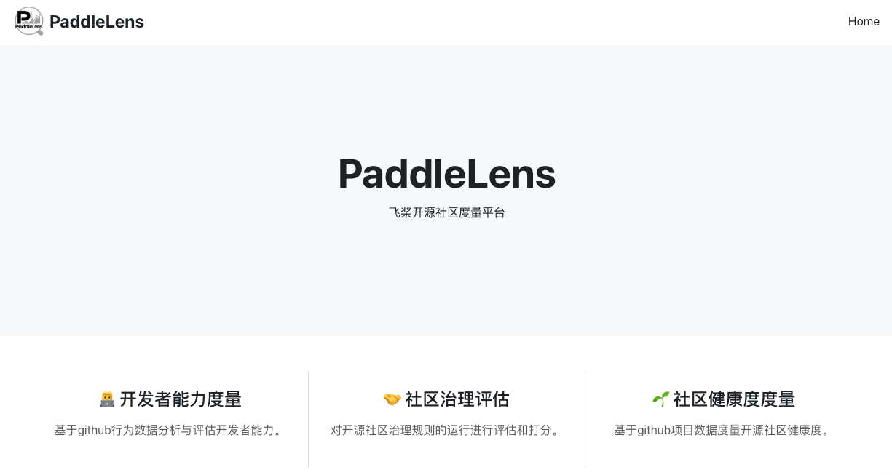

# PaddleLens

<p align="center">
  
</p>

欢迎来到PaddleLens！

这是一个为飞桨开源社区打造的社区度量平台，包括三个部分：

* 开发者能力度量：通过开发者在飞桨相关项目中的贡献数据度量其能力，包含基本信息、在飞桨中的开发经验、硬技能与软技能4个部分。
* 社区治理评估：展示飞桨开发者对飞桨社区治理规则的评分。治理规则评估包含针对项目使用、社区共享、项目组织和维护三个维度的18项评估指标。
* 社区生态分析：通过Github开发数据，度量飞桨相关项目社区的健康度，包含活力、组织、韧性、四个维度。

此外，PaddleLens代码仓库中还包含对飞桨下游生态进行手动和自动分析的数据处理过程，有助于未来再次分析飞桨下游生态时对分析方法进行复用。

## 安装与使用方法

#### 1.克隆项目

```bash
git clone https://github.com/PFCCLab/PaddleLens.git
```
#### 2.数据准备

数据集请联系[维护者](https://github.com/dune0310421)。

在根目录建立`.env`文件，复制以下内容并按需替换：
```bash
GITHUB_TOKEN=xxx # 你的github api token 
OPENAI_BASE_URL=xxx # 你的openai base url，如果使用我们提供的数据集，无需填写
OPENAI_API_KEY=xxx # 你的openai api key，如果使用我们提供的数据集，无需填写
NOWDATE=2025-06-30  # 分析截止时间，如果使用我们提供的数据集，无需修改
```

#### 3.运行后端
请确保已安装以下环境：
* Python ≥ 3.8（建议使用 Python 3.9 或更高版本）
* pip（Python 包管理器，建议使用最新版）
* 推荐使用 virtualenv 或 conda 建立虚拟环境，避免依赖冲突

在终端安装后端依赖：
```bash
cd PaddleLens/backend
pip install -r requirements.txt
```

启动开发服务（默认使用 Uvicorn + FastAPI）：
```bash
uvicorn main:app --reload
```
后端默认监听在8000窗口，可以使用PastAPI提供的API文档 http://127.0.0.1:8000/docs 访问后端api。

#### 4.运行前端
请确保已安装以下环境：
- Node.js（建议版本 >= 16.x）
- npm（随 Node 自带）

新建终端，安装前端依赖：
```bash
cd PaddleLens/fronted
npm install
```

启动前端服务：
```bash
npm run dev
```

前端默认监听在5173窗口。

#### 5.使用

在浏览器打开 http://127.0.0.1:5173 ，来到主页。

在主页点击“开发者能力度量”，进入度量界面。在输入框中输入用户的github username(注意不是可自定义的Name)，点击“分析”，得到能力度量结果。

在主页点击“社区治理评估”，系统会展示最新的飞桨开发者对飞桨社区治理规则的评分。

在主页点击“社区生态分析”，在输入框中输入飞桨项目名称（如“PaddlePaddle/Paddle”），点击“分析”，得到健康度度量结果。健康度度量仅支持PaddlePaddle和PFCCLab两个组织下的项目。


## 贡献

有任何问题、想法，请提issue。